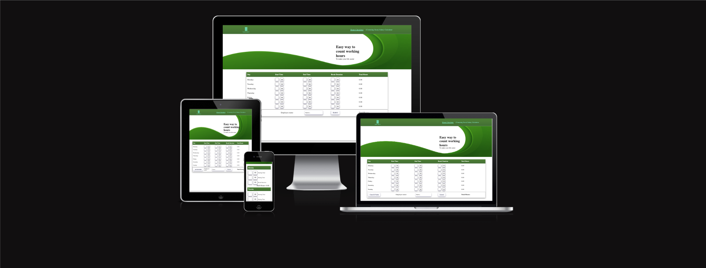

# CI-project-2

## Work Hours Calculator
This project is dedicated to my wife whose responsibility is counting her coworkers working hours every fortnight.
Hours calculator is in MVP state currently. It is made with plain JS, HTML, CSS.
I avoided using any libraries in this project. Calculator is fully responsive but it is recommended to use it with desktop or tablet with keyboards attached.

[View website in GitHub Pages](https://mich1991.github.io/CI-project-2)

### The business goals for this website are:

1. Let the users easily count theirs or theirs coworkers/employees working hours.
2. Create good user experiences for visitors.
3. Build potential client database with newsletter.

### User stories

1. As a user I would like to easily count working hours for myself or my employees.
    +  form is build in intuitive way. 
2. As a user I would like to be able to write down/save calculation result and identify them later easily.
    + On submit user can provide employee/coworker name that would be written down below calculator allowing to check person again later or delete result if needed.
3. I would like to provide as small inputs myself as possible.
    + People are mostly starting work at full hours like 9.00 and finish them at 17.00. That is why minutes are set as default to 00 so user doesn't have to waste time on inputing minutes in calculator.
    + If user country is deducting break time from total working hour it can be easily deducted by providing break duration.
4. I would like to quickly jump between inputs, so I don't need to use a mouse.
    + By pressing TAB on keyboard user can easily jump between input fields in correct order to improve submiting form time.
5. I would like to erase everything from form and start clean.
    + Form can be cleared by pressing "Clear All Fields" Button on the form.
6. I would like to keep updated about new features coming to calculator or about salary calculator.
    + Newsletter form is submiting user email to formspree.io which is connected to my email address. Thanks to that I can build customer/subscribers database.
7. I would like to use this app offline.
    + This site doesn't rely on any 3rd party library/CDN font awesome, bootstrap & etc. Thanks to that user has the same experiences either with internet connection or without.

## Technology Used:

###Languages Used:
+ HTML
+ CSS
+ Javascript

### Frameworks, Libraries & Programs Used
+ [Photopea](https://www.photopea.com/) - photos resizing.
+ [Formspree](https://formspree.io/) - newsletter form submit.

