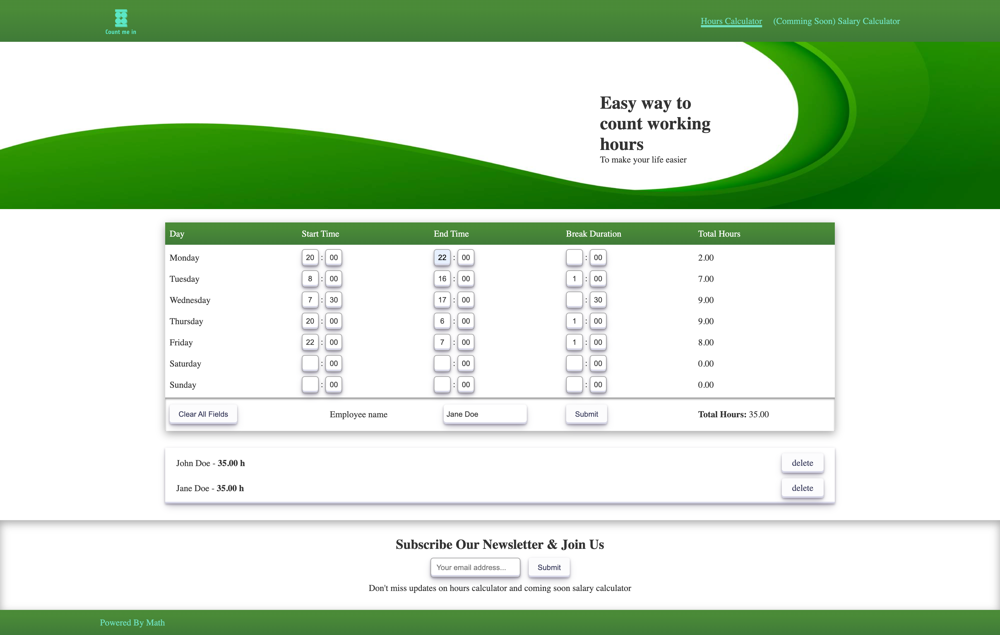
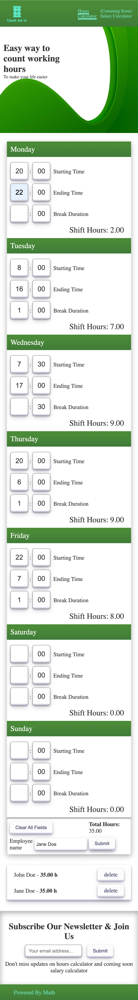
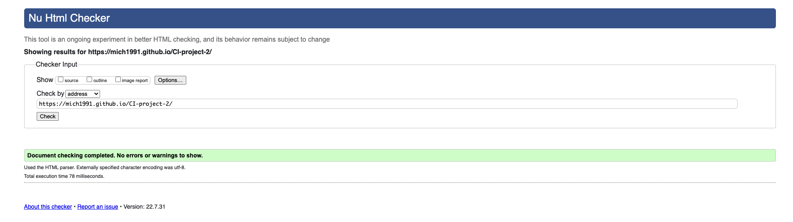
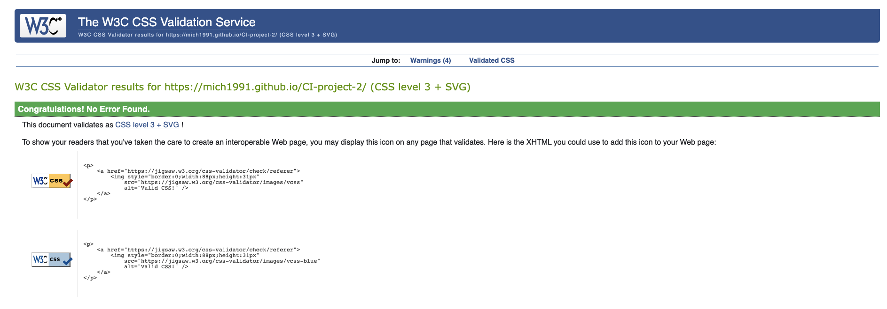
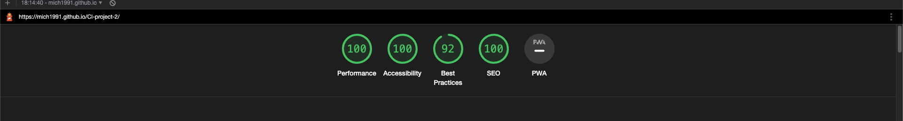

# CI-project-2


## Work Hours Calculator
This project is dedicated to my wife whose responsibility is counting her coworkers working hours every fortnight.
Hours calculator is in MVP state currently. It is made with plain JS, HTML, CSS.
I avoided using any libraries in this project. Calculator is fully responsive but it is recommended to use it with desktop or tablet with keyboards attached.

[View website in GitHub Pages](https://mich1991.github.io/CI-project-2)

### The business goals for this website are:

1. Let the users easily count theirs or theirs coworkers/employees working hours.
2. Create good user experiences for visitors.
3. Build potential client database with newsletter.

### User stories

1. As a user I would like to easily count working hours for myself or my employees.
    +  form is build in intuitive way. 
2. As a user I would like to be able to write down/save calculation result and identify them later easily.
    + On submit user can provide employee/coworker name that would be written down below calculator allowing to check person again later or delete result if needed.
3. I would like to provide as small inputs myself as possible.
    + People are mostly starting work at full hours like 9.00 and finish them at 17.00. That is why minutes are set as default to 00 so user doesn't have to waste time on inputing minutes in calculator.
    + If user country is deducting break time from total working hour it can be easily deducted by providing break duration.
4. I would like to quickly jump between inputs, so I don't need to use a mouse.
    + By pressing TAB on keyboard user can easily jump between input fields in correct order to improve submiting form time.
5. I would like to erase everything from form and start clean.
    + Form can be cleared by pressing "Clear All Fields" Button on the form.
6. I would like to keep updated about new features coming to calculator or about salary calculator.
    + Newsletter form is submiting user email to formspree.io which is connected to my email address. Thanks to that I can build customer/subscribers database.
7. I would like to use this app offline.
    + This site doesn't rely on any 3rd party library/CDN font awesome, bootstrap & etc. Thanks to that user has the same experiences either with internet connection or without.

## Mockup
### Dektop

### Mobile

## Technology Used:

###Languages Used:
+ HTML
+ CSS
+ Javascript

### Frameworks, Libraries & Programs Used
+ [Photopea](https://www.photopea.com/) - photos resizing.
+ [Formspree](https://formspree.io/) - newsletter form submit.
+ [Hatchful](https://hatchful.shopify.com/) - logo generator.
+ [Freepik](https://www.freepik.com/vectors/wide-banner) - Wide banner vector created by starline
  

## Future features:
   + Save employees/submission result to cookies/local storage.
   + Export users/employees to CSV.
   + Refactor employee object to contain all details about working hours instead only total hours.
   + Allow editing saved employee (currently only delete available)
   + After adding editing employee/user - add clear form after submit. Currenlty form is not cleared after submit allowing for check again for any errors.

## JS Code Walkthrough
HoursCalculator is build by 2 Classes. 
+ Day class is responsible for controlling and validating data assigned to that day.
+ HoursCalculator class is a kind of manager of application it is responsible of collecting and managing data provided by each Day instances.  

Code is starting with fetching DOM elements. Since there is plenty of inputs
in form instead of querying each of them one by one I used for loops.
Every input field has similar build selector. It's starting with prefix according to day of the week and suffix fitting either start , end or break ('s', 'h', 'b') rest is either 'hours' or 'minutes'.

```
const daysOfTheWeekObjects = [
    {name: 'Monday', prefix: 'm'},
    {name: 'Tuesday', prefix: 't'},
    {name: 'Wednesday', prefix: 'w'},
    {name: 'Thursday', prefix: 'tr'},
    {name: 'Friday', prefix: 'f'},
    {name: 'Saturday', prefix: 'sa'},
    {name: 'Sunday', prefix: 'su'},
];
const domInputElementsSufix = ['-s-hours', '-s-minutes', '-e-hours', '-e-minutes', '-b-hours', '-b-minutes', '-total-hours'];
const daysOftheWeek = {};

daysOfTheWeekObjects.forEach(day => {
    let domElements = [];
    domElements.push(document.querySelector(`#${day.name}`))
    domInputElementsSufix.forEach(sufix => {
        domElements.push(document.querySelector(`#${day.prefix}${sufix}`))
    })
    daysOftheWeek[day.name] = domElements;
})
```
The DOM elements are assigned to Day class instances using spread operator at the end of the file and next each day is assigned to HoursCalculator class instance.


```

const Monday = new Day(...daysOftheWeek['Monday']);
const Tuesday = new Day(...daysOftheWeek['Tuesday']);
const Wednesday = new Day(...daysOftheWeek['Wednesday']);
const Thursday = new Day(...daysOftheWeek['Thursday']);
const Friday = new Day(...daysOftheWeek['Friday']);
const Saturday = new Day(...daysOftheWeek['Saturday']);
const Sunday = new Day(...daysOftheWeek['Sunday']);
const hoursCalculator = new HoursCalculator(Monday, Tuesday, Wednesday, Thursday, Friday, Saturday, Sunday)

```

### Day Class
Idea of the class is to manage all data of single day in the form and validating it by listening to the input event on a div container of each day.
this.clearShiftHours(); - is only here to change total hours span textContent of '0.00'. 
```
class Day {
    isDayValid = true;

    constructor(dayContainer, hourStartEl, minuteStartEl, hourEndEl, minuteEndEl, hourBreakEl, minuteBreakEl, totalEl) {
        this.dayContainer = dayContainer;
        this.workHourStart = hourStartEl;
        this.workMinuteStart = minuteStartEl;
        this.workHourEnd = hourEndEl;
        this.workMinuteEnd = minuteEndEl;
        this.workHourBreak = hourBreakEl;
        this.workMinuteBreak = minuteBreakEl;
        this.totalWorkTime = totalEl;
        this.inputsArray = [hourStartEl, minuteStartEl, hourEndEl, minuteEndEl, hourBreakEl, minuteBreakEl]

        this.clearShiftHours();
        this.dayContainer.addEventListener('input', this.validateDay.bind(this));
    }

```
CountDayShift() - class method responsible for converting each of the day input into minutes assuring they are type of Number and counting total amount of hours worked this day.

clearShiftHours() - method responsible for clearing html content of span element total-hours.
```
countDayShift() {
        if (this.isDayValid === false) return 0;
        let shiftDuration = 0;
        let startMinutes = (+this.workHourStart.value * 60) + +this.workMinuteStart.value;
        let endMinutes = (+this.workHourEnd.value * 60) + +this.workMinuteEnd.value;
        let breakMinutes = (+this.workHourBreak.value * 60) + +this.workMinuteBreak.value;
        if (this.workHourStart.value !== '' && this.workHourEnd.value !== '') {
            if (startMinutes > endMinutes) {
                let dayMaxMinutes = 24 * 60;
                shiftDuration = ((dayMaxMinutes - startMinutes + endMinutes - breakMinutes) / 60).toFixed(2);
            } else {
                shiftDuration = ((endMinutes - startMinutes - breakMinutes) / 60).toFixed(2);
            }
            if (shiftDuration < 0) shiftDuration = 0;
            return +shiftDuration;
        } else {
            this.clearShiftHours();
            return 0;
        }
    }

    clearShiftHours() {
        this.totalWorkTime.innerText = '0.00';
    }
```
clearInputs() method is responsible for reset values of each input in class.
```
  clearInputs() {
        this.inputsArray.forEach(input => input.classList.remove('error'))  
        this.workHourStart.value = '';
        this.workMinuteStart.value = '00';
        this.workHourEnd.value = '';
        this.workMinuteEnd.value = '00';
        this.workHourBreak.value = ''
        this.workMinuteBreak.value = '00';
        this.totalWorkTime.innerText = '0.00'
    }
```
validateDay() - method is checking if every input field of the day is valid if yes values are displayed if not total-hours span is display as 0.00 and amount of incorrect hours are NOT passed to HoursCalculator class.  

validateSingleInput(input) - method is responsible for validating single input by comparing if its HTML data-valid attribute is bigger than input value.
It is also responsible for adding 'error' class to input element if it is invalid.
```
    validateDay() {
        const errorArray = [];
        const inputsArray = [this.workHourStart, this.workMinuteStart, this.workHourEnd, this.workMinuteEnd, this.workHourBreak, this.workMinuteBreak]
        inputsArray.forEach(input => {
            errorArray.push(this.validateSingleInput(input))
        })
        if (errorArray.includes(false)) {
            this.clearShiftHours();
            this.isDayValid = false;
        } else {
            this.totalWorkTime.innerText = this.countDayShift().toFixed(2);
            this.isDayValid = true;
        }
    }
    validateSingleInput(input) {
        const maxValue = +input.dataset.valid
        // Stackoverflow solution
        // https://stackoverflow.com/questions/33299639/allow-only-2-numbers-on-input-type-number
        input.value = input.value.replace(/[^0-9.]/g, '').replace(/(\..*?)\..*/g, '$1');
        if (input.value > maxValue) {
            input.classList.add('error');
            return false;
        } else {
            input.classList.remove('error');
            return true;
        }
    }
```
### HoursCalculator
HoursCalculator - manager type of class. It is responsible for taking care of data provided by each day,handling form submission, displaying form results and all the logic necessary by that.
constructor of class assigns to event listeners to class.
Submit event with bind of 'this' letting correctly control data on submit.
Input event which updating whole working week total hours.
```
class HoursCalculator {
    hoursCalculatorForm = document.querySelector('#hours-calculator')
    weekTotalHoursDOMel = document.querySelector('#week-total-hours');
    employeeID = 0
    employeesArray = []
    employeeDisplayDOMel = document.querySelector('#employee-display')
    employeeName = document.querySelector('#employee')

    constructor(monday, tuesday, wednesday, thursday, friday, saturday, sunday) {
        this.Monday = monday
        this.Tuesday = tuesday
        this.Wednesday = wednesday
        this.Thursday = thursday
        this.Friday = friday
        this.Saturday = saturday
        this.Sunday = sunday
        this.daysArray = [this.Monday, this.Tuesday, this.Wednesday, this.Thursday, this.Friday, this.Saturday, this.Sunday];

        this.hoursCalculatorForm.addEventListener('submit', this.handleSubmit.bind(this))
        this.hoursCalculatorForm.addEventListener('input', () => this.weekTotalHoursDOMel.textContent = this.countWholeWeek())
    }
```
CountWholeWeek - method is gathering data from each day of the week and thanks to array reduce method is adding all hours together.

ClearCalculator - method is invoking Day clearInput method on every day of the week plus clearing input value for employee & weekTotalHoursDOMel element.
```
    countWholeWeek = () => {
        return this.daysArray.map(day => day.countDayShift()).reduce((a, c) => a + c, 0).toFixed(2);
    }
    
    clearCalculator() {
        this.daysArray.forEach(day => day.clearInputs());
        this.employeeName.value = '';
        this.weekTotalHoursDOMel.innerHTML = ''
    }

```
appendDivToDOM - method is taking care of displaying form submit result as a list of employees which can be deleted thanks to unique employee id attached to each employee.

clearParentElement - method used for updating DOM display of employees/users list.

removeEmployee - method responsible for handling delete of employee from the list.
```
    appendDivToDOM = (parentElement, content) => {
        let div = document.createElement('div');
        div.innerHTML = `
        <p>${content.name} - <strong>${content.totalHours} h</strong></p>
        <a class="button" onclick="hoursCalculator.removeEmployee(${content.id})">delete</a>`;
        parentElement.append(div);
    }

    clearParentElement = (parentElement) => {
        parentElement.innerHTML = ''
    }
    removeEmployee = (id) => {
        this.clearParentElement(this.employeeDisplayDOMel);
        this.employeesArray = this.employeesArray.filter(employee => employee.id !== id);
        this.employeesArray.forEach(employee => this.appendDivToDOM(this.employeeDisplayDOMel, employee));
    }
```
handleSubmit - method responsible for handling submit event. push result into employee array and trigger clearing DOM and rendering new employees values.
```
    handleSubmit(e) {
        e.preventDefault();
        let name = this.employeeName.value
        let totalHours = this.countWholeWeek()
        this.employeesArray.push({id: this.employeeID, name, totalHours})
        this.employeeID++
        this.clearParentElement(this.employeeDisplayDOMel);
        this.employeesArray.forEach(employee => this.appendDivToDOM(this.employeeDisplayDOMel, employee));
    }
```
## Testing
Manual testing discovered some errors connected to error handling like not removing 'error' class upon clearing every input displaying correct values on whole week total hours calculation. Preventing impossible values to be counted. All of the issues has been fixed yet.


### [HTML validator](https://validator.w3.org/)



### [CSS validator](https://jigsaw.w3.org/css-validator/)



###Lighthouse - desktop


###Lighthouse - mobile


## Credits
Huge thanks to my wife for motivating me to build a tool/app/website that would make her work easier and me proud of myself.
Thanks to my mentor [Guido Cecilio Garcia Bernal](https://github.com/guidocecilio) guided me throughout this project.


